<h1 align="center">TRANQUIL BLOG</h1>

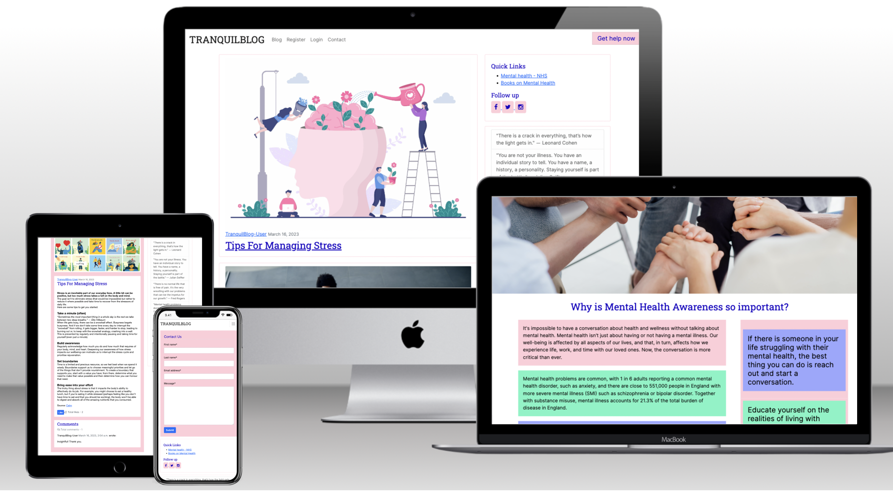

### **Live Site:**

[Click here to visit the live site.](https://tranquilblog.herokuapp.com/)

## **About**
Tranquil Blog was created to increase awareness of mental health and seeking help. Because of misconceptions and stigma surrounding mental health issues, people often suffer in silence and don't seek treatment for their conditions. Raising community awareness of mental health issues helps eliminate the stigma and makes it easier for people to seek help. This platform aims to be a safe space where users can gain more information on mental health and share their personal experiences. 

## **Wireframes**

This was created for the first submission but has been expanded further for the current project to meet the requirements, hence some additional features not show in the wireframes below. 

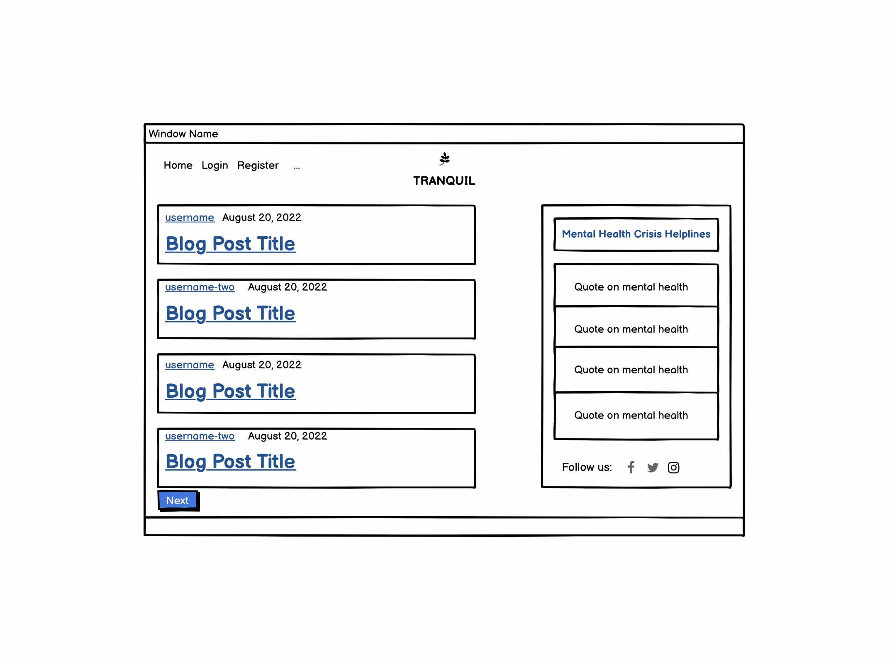
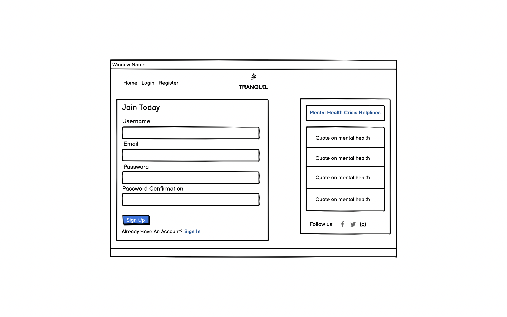
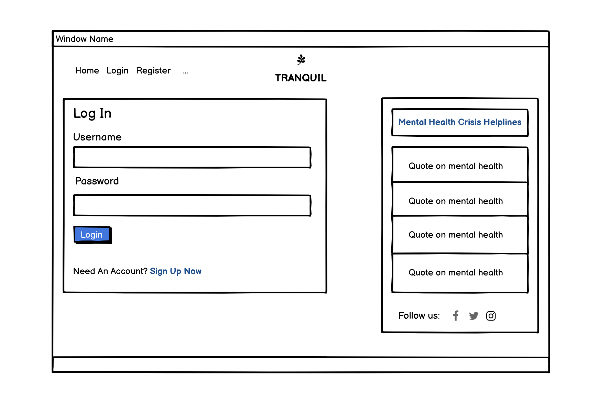
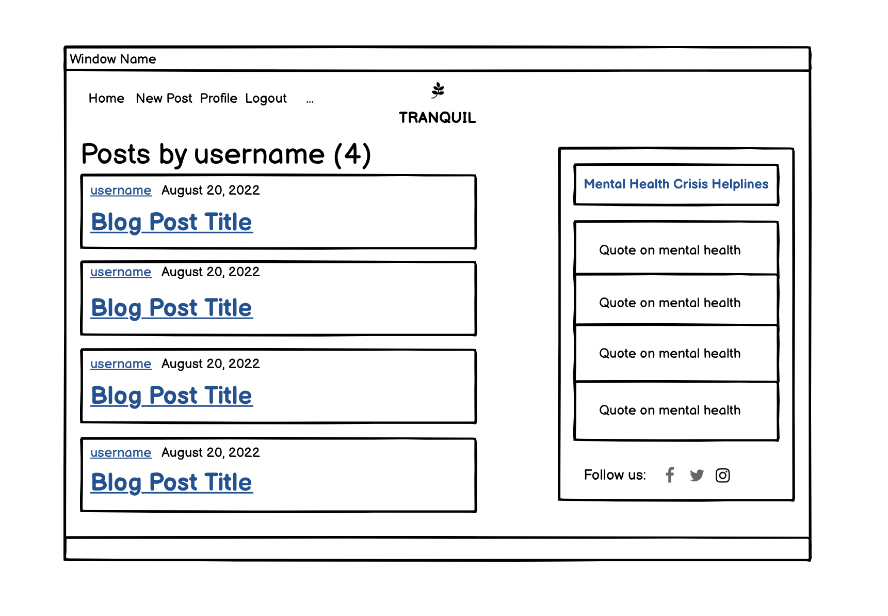
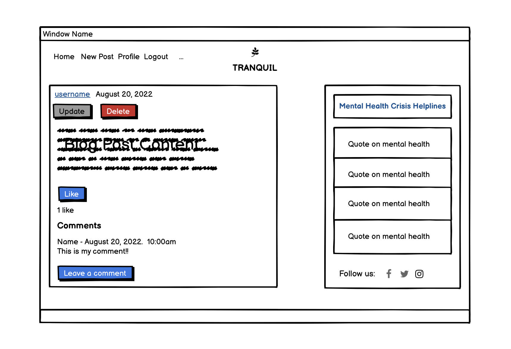
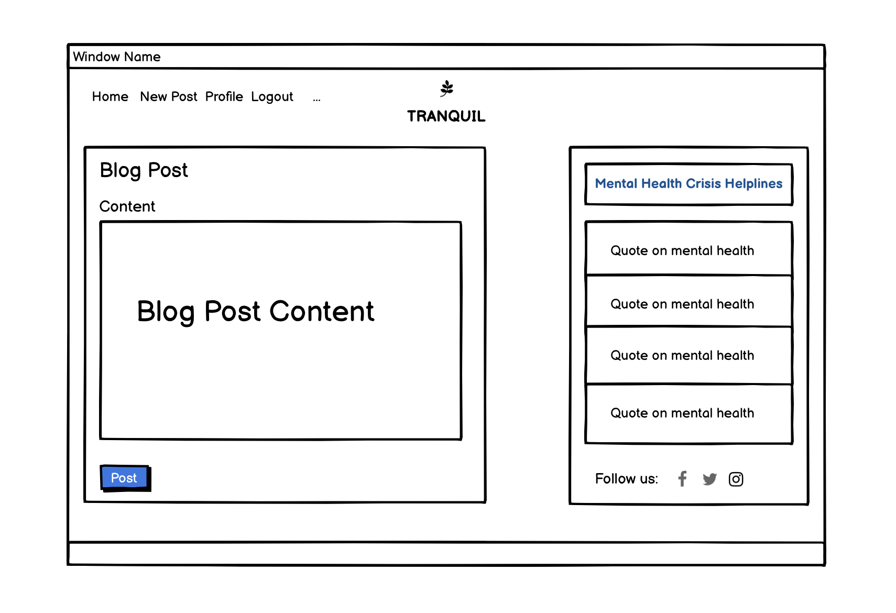
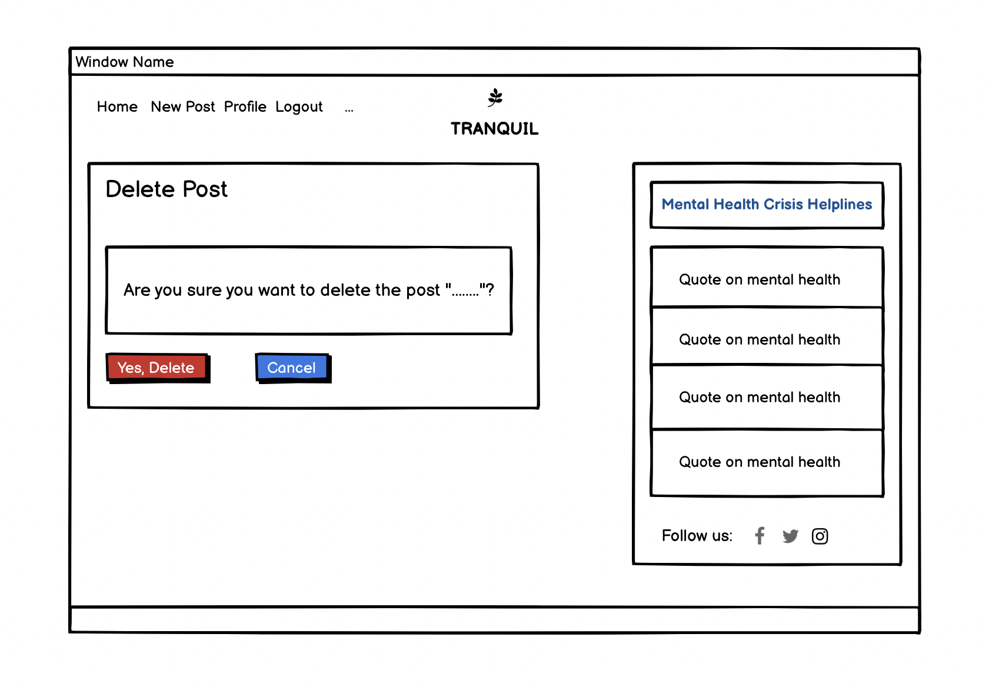
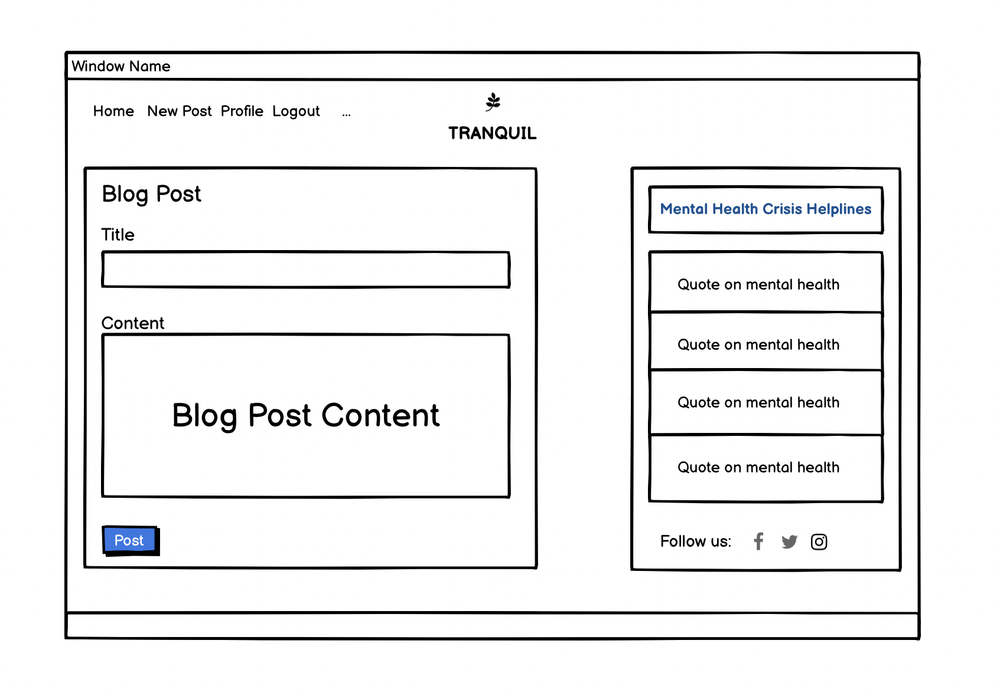

[Back to top](#)

## **User Experience - UX**

### **Agile Methodology**
All functionality and development of this project were managed using GitHub which Projects can be found [here](https://github.com/users/Oyindamolabadara/projects/5/views/1)
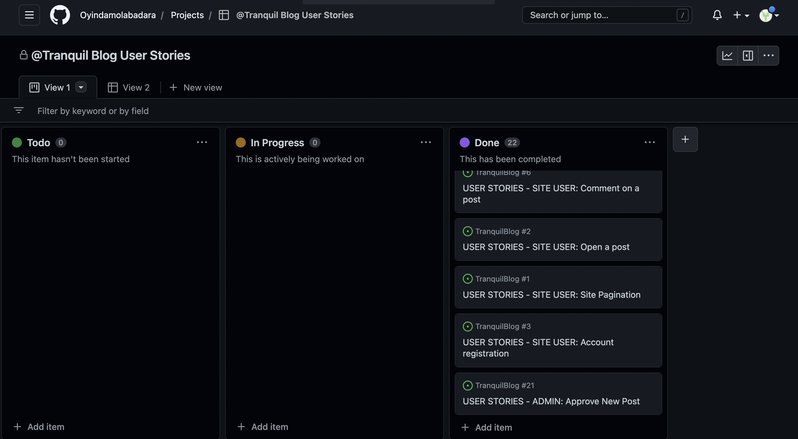

### **User Stories**

### **Site User**
* Account registration: As a Site User, I can register an account so that I can comment and like posts. 
* Login/Logout: As a Site User, I can log in/log out so that I can access my account and protect my account from unauthorised access. 
* Open a post: As a Site User, I can click on a post so that I can read the full text.
* View post list: As a Site User, I can view a paginated list of posts so that I can select one to read.
* Create a new post: As a Site User, I can create a new post so that I can create content for other users to engage with.
* User Posts Page: As a Site User, I can click on a user’s link, so that I can see all posts by the specific user.
* User Posts Page: As a Site User, I can click on a user’s link, so that I can see all posts for the specific user.
* Delete post: As a Site User, I can delete my posts so that I can permanently remove posts I do not wish to keep.
* Edit post: As a Site User, I can edit my posts so that I can update any changes or mistakes.
* Comment on a post: As a Site User, I can leave comments on a post so that I can be involved in the conversation. 
* View comments: As a Site User, I can view comments on an individual post so that I can read the conversation. 
* View likes: As a Site User, I can view the number of likes on each post so that I can see which is the most viral.
* Profile picture: As a Site User, I can add a profile picture so that I can create a connection with other users. 
* Profile page: As a Site User, I can have a profile page so that I can create a connection with other users. 
* Contact form: As a Site User, I can fill in a contact form, so that I can make enquiries and get in touch with the site admin. 
* Password reset: As a Site User, I can request a password reset so that  I can secure my account.
* Password request: As a Site User, I can request a password so that I can log back into my account if I have forgotten my password.

### **Admin**

* Approve posts: As a Site Admin, I can approve or disapprove new posts so that I can filter out objectionable posts.
* Approve comments: As a Site Admin, I can approve or disapprove comments so that I can filter out objectionable comments.
* View comments: As a Site Admin, I can view comments on an individual post so that I can read the conversation.
* View likes: As a Site Admin, I can view the number of likes on each post so that I can see which is the most viral.
* Create drafts: As a Site Admin, I can create draft posts so that I can finish writing the content later.
* Manage posts: As a Site Admin, I can create, read, update and delete posts so that I can manage my blog content.

## **Features**

### **Existing Features**
* Navigation Links:
    * The header contains the navigation links; Logo(redirects to the home page), Blog, login, Register and Contact for users who are not logged in. 
    * The navigation bar is featured on every page throughout the site to allow users easy access should they want to go to a different page.
    * The header also contains the logo of the website at the top left of the navigation bar, which redirects users to the home page when clicked on. 
    * For logged-in users, the navigation links include; Logo, Blog, New Post, Profile and Logout and Contact. 
    * On smaller screens, the logo is modified into a dropdown menu which provides users with the same navigation. 
    * A very important feature in the NavBar is the “Get Help Now” link. It is a quick link to helplines and support for anyone going through a mental health crisis. During my research, I found this feature implemented in almost every mental health website I came across. 
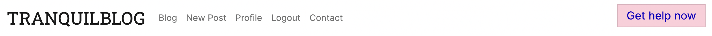
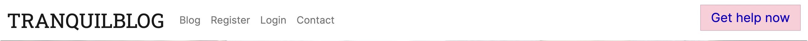

* Register:
    * Featured on this page is a form for users to get registered on the blog app. 
    * After the successful completion of the registration form, the user gets a success message.
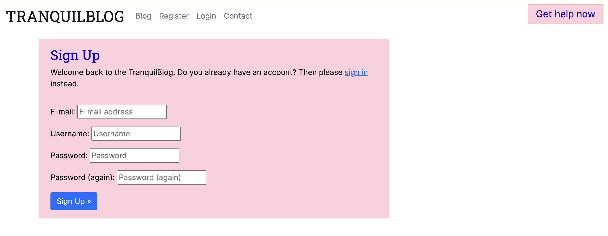

* Log in:
    * Users can access their accounts via the login feature.
    * By logging in the users can publish and manage their blog posts (update and delete). They can also like and comment on others' posts.
    * The user is directed back to the home page once logged in.
    * The user is also prompted to register if an account has not been created. 
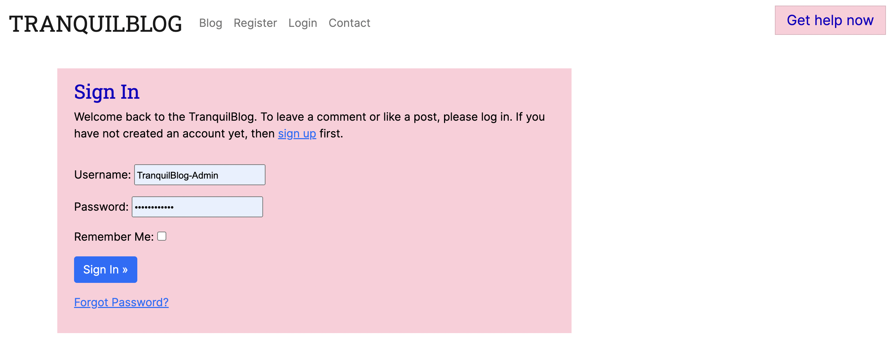

* New Post:
    * Featured here is a section allowing users to create and post new content. 
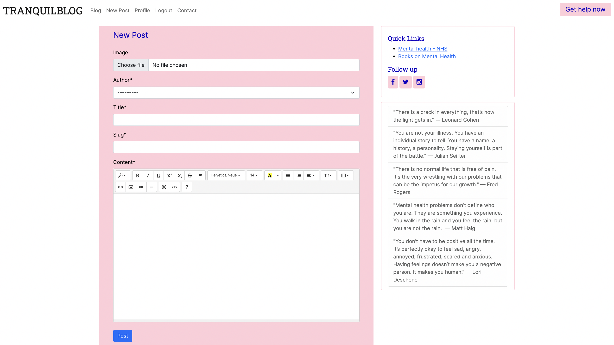

* Blog Posts:
    * Featured on the home page is access to blog posts.
    * The user can read the full post after clicking on the title. 
    * Featured at the top of the blog posts are the update and delete buttons.
    * To delete a post, the user is asked to confirm deleting the post.
    * Users are also able to like / unlike blog posts. 
    * The comment section allows users read comments and submit new comments for approval.  
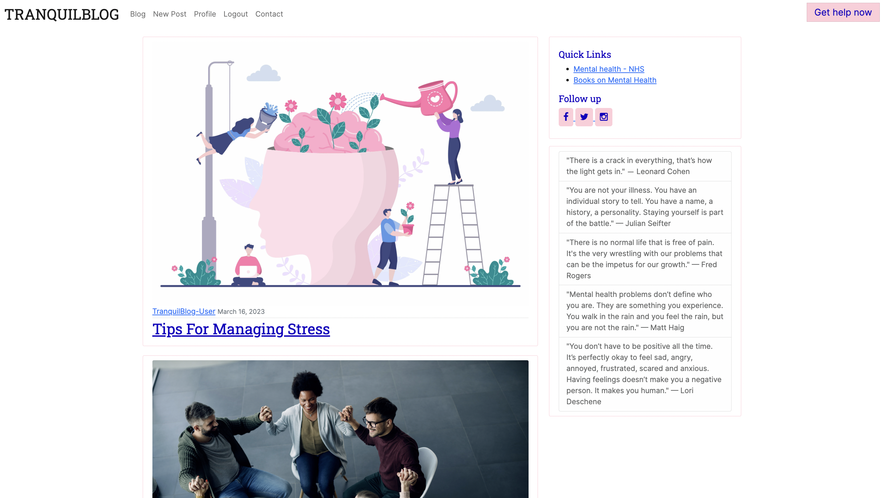
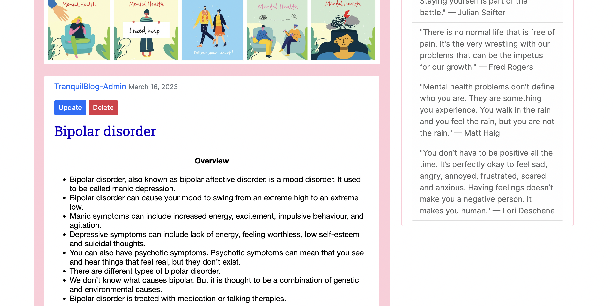
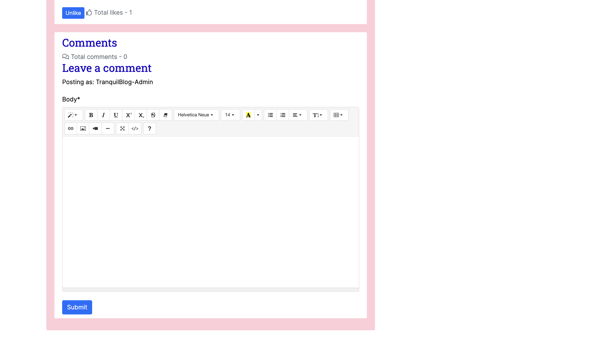

* Profile:
    * Featured on the profile page are the details of a logged-in user. 
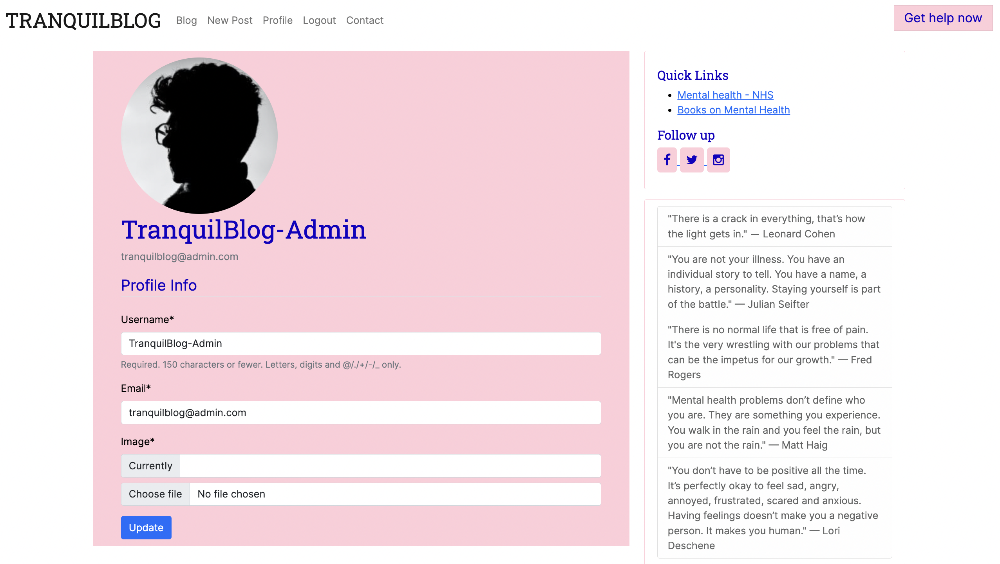

* Side Bar:
    * The sidebar contains quick links to additional resources on mental health and social media links. 
    * The sidebar also contains card boxes of different inspiring quotes on mental health.
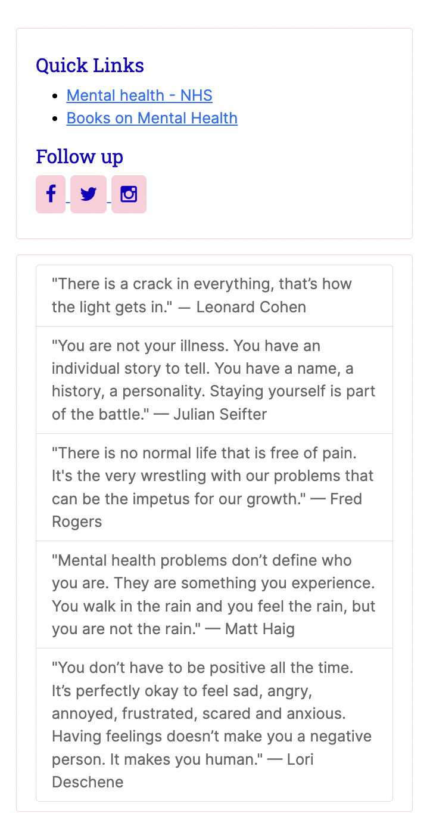

* Contact: This page renders a contact us form.  
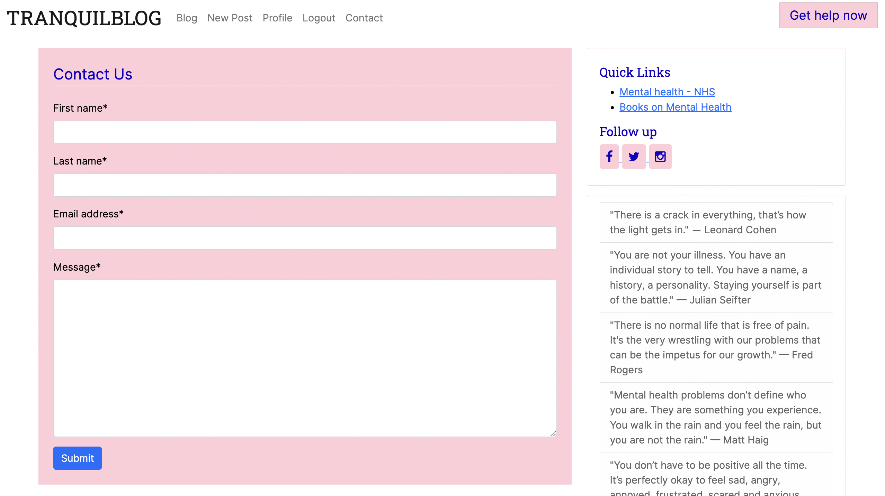

* Page Navigation:
    * These are the next and previous buttons to enable users convenient flow from one page to another. 
* Admin Panel/Superuser:
    * On the Admin Panel, as an admin/superuser, I have full access to CRUD functionality so I can view, create, edit and delete the following ones:
        * Posts
        * Comments
        * User Profiles
    * As an admin/superuser I can also approve comments, approve posts, change the status and give other permissions to the users.
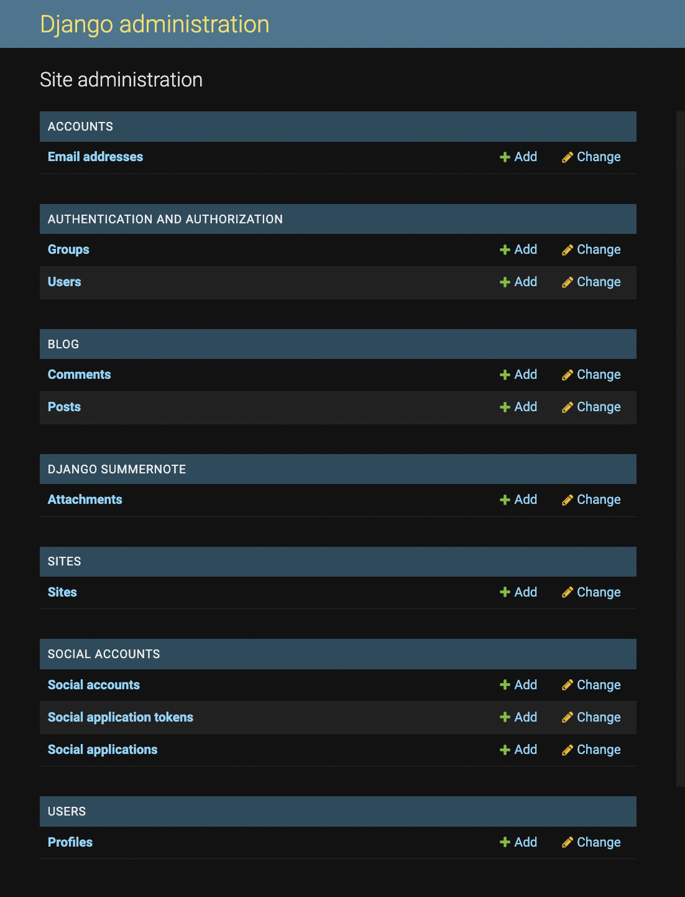

### **Structure and Inspiration**

Having extensively researched different mental health websites during the planning process, [Mind](https://www.mind.org.uk/) was a major inspiration for me in terms of context and theme. [Corey Schafer’s Django Tutorials’](https://www.youtube.com/playlist?list=PL-osiE80TeTtoQCKZ03TU5fNfx2UY6U4p) was also a very significant resource in planning the structure of this project. 

### **Colour and Theme**
The colours used were taken from [Mind’s website](https://www.mind.org.uk/). Implementing the colour, theme and notable buttons were prioritised to help boost the overall value of the application. 

### **Font**
I choose the Inter and Roboto Slab fonts, as they both maintain great readability and are versatile. 

[Back to top](#)

## Languages / Technologies Used

* HTML
* CSS
* JavaScript
* Python

## Frameworks, Libraries & Programs Used
* Django: Framework used in the development of the app. 
* Git: was used for version control by utilising the GitPod terminal to commit to Git and push to GitHub.
* GitHub: was used to store the overall project repository. 
* Bootstrap: was used for the design and structure of the app; grid, layout, columns, cards and forms structure.
* JQuery: The scripts were written using the jQuery library.
*PostgreSQL: Database used through Heroku.
* Django Allauth: was used for authentication, registration and account management.
* Cloudinary: was used to host the static files and media.
* Summernote: was used to allow users to add styling to the blog posts and comments.  
* Crispy Form: was used for rendering the behaviour of the forms. 
* Font Awesome: was used to import icons for UX purposes.
* Am I Responsive: was used to seeing responsive design throughout the process and to generating mockup imagery to be used.
* Balsamiq Wireframes: was used in the initial design process to make wireframes.
* Heroku: used for the deployment of the project.
* Google Chrome Dev Tools: was used to check for responsiveness and debugging.
* Lighthouse: used for testing site functionality.
* W3C Markup Validation Service: used for HTML testing.
* W3C CSS Validation Service: used for CSS testing
* PEP8: used for Python file testing.

### **Testing and Code Validation:**

[Click here for details.](/TESTING.md)

## **Deployment, Forking and Cloning**

### Creating the Django app

1. Go to the Code Institute Gitpod Full Template [Template](https://github.com/Code-Institute-Org/gitpod-full-template).
2. Click on Use This Template.
3. Once the template is available in your repository click on Gitpod.
4. When the image for the template and the Gitpod are ready, open a new terminal to start a new Django App.
5. Install Django and gunicorn: `pip3 install Django gunicorn`.
6. Install supporting database libraries dj_database_url and psycopg2 library: `pip3 install dj_database_url psycopg2`.
7. Create a file for requirements: in the terminal window type `pip freeze --local > requirements.txt`.
8. Create a project: in the terminal window type django-admin startproject your_project_name.
9. Create app: in the terminal window type python3 manage.py startapp your_app_name.
10. Add the app to the list of installed apps in the settings.py file: you_app_name.
11. Migrate changes: in the terminal window type, python3 manage.py migrate.
12. Run the server to test if the app is installed, in the terminal window type python3 manage.py runserver.
13. If the app has been installed correctly, the window will display “The install worked successfully!. Congratulations!”.

### Deployment of This Project

This site was deployed by completing the following steps:

1. Log in to [Heroku](https://id.heroku.com) or create an account.
2. On the main page click the button labelled New in the top right corner and from the drop-down menu select Create New App.
3. You must enter a unique app name.
4. Next select your region.
5. Click on the Create App button.
6. Click on resources and select Heroku Postgres database.
7. Click Reveal Config Vars and add a new record with SECRET_KEY.
8. Click Reveal Config Vars and add a new record with the `CLOUDINARY_URL`.
9. Click Reveal Config Vars and add a new record with the `DISABLE_COLLECTSTATIC = 1`.
10. The next page is the project’s Deploy Tab. Click on the Settings Tab and scroll down to Config Vars.
11. Next, scroll down to the Buildpack section click Add Buildpack select python and click Save Changes.
12. Scroll to the top of the page and choose the Deploy tab.
13. Select Github as the deployment method.
14. Confirm you want to connect to GitHub.
15. Search for the repository name and click the connect button.
16. Scroll to the bottom of the deploy page and select the preferred deployment type.
17. Click either Enable Automatic Deploys for automatic deployment when you push updates to GitHub.

### Final Deployment 

1. Create a runtime.txt `python-3.8.13`.
2. Create a Procfile `web: gunicorn your_project_name.wsgi`.
3. When development is complete change the debug setting to: `DEBUG = False` in settings.py.
4. In this project the summernote editor was used so for this to work in Heroku add: `X_FRAME_OPTIONS = SAMEORIGIN `to
  settings.py.
5. In Heroku settings, delete the config vars for `DISABLE_COLLECTSTATIC = 1`.

### Forking This Project

Fork this project by following the steps:

1. Open [GitHub](https://github.com/Oyindamolabadara/TranquilBlog.git).
2. Find the 'Fork' button at the top right of the page.
3. Once you click the button the fork will be in your repository.

### Cloning This Project

Clone this project by following the steps:

1. Open [GitHub](https://github.com/Oyindamolabadara/TranquilBlog.git).
2. You will be provided with three options to choose from, HTTPS, SSH or GitHub CLI, click the clipboard icon to copy the URL.
3. Once you click the button the fork will be in your repository.
4. Open a new terminal.
5. Change the current working directory to the location where you want the cloned directory.
6. Type 'git clone' and paste the URL copied in step 3.
7. Press 'Enter' and the project is cloned.

## **Credits**

### Code
* [Django Tutorials - Corey Schafer](https://www.youtube.com/playlist?list=PL-osiE80TeTtoQCKZ03TU5fNfx2UY6U4p).
* Update and Delete blog post - [Codemy](https://www.youtube.com/playlist?list=PLCC34OHNcOtr025c1kHSPrnP18YPB-NFi).
* Like/Unlike section - [Coding Tranquility’s](https://codingtranquillity.herokuapp.com/blogpost/2/).
* Building a blog application - [Django Central](https://djangocentral.com/building-a-blog-application-with-django/).
* Pagination - [Django Central](https://djangocentral.com/adding-pagination-with-django/).
* Contact Form - [Ordinary Coders](https://ordinarycoders.com/blog/article/build-a-django-contact-form-with-email-backend).

### Media
* Profile picture image - [Pexels](https://www.pexels.com/photo/man-in-black-jacket-771742/).
* [Image compressor](https://imagecompressor.com/).
* Resize profile image - [Adobe express](https://www.adobe.com/express/feature/image/resize).
* Blog images - [Adobe stock](https://stock.adobe.com/uk/).
* Grammar Checker - [Grammarly](https://www.grammarly.com/)

### Blog Post Content and Crisis Helplines
* [Rethink Mental Illness](https://www.rethink.org/)
* [Mind](https://www.mind.org.uk/)
* [Calm](https://www.calm.com/blog/)

## **Acknowledgements**
I would like to thank the tutors at Code Institute and Mentor, [Anthony Ugwu](https://github.com/tonyguesswho) for their assistance and support. 

[Back to top](#)

