<h1 align="center">TRANQUILBLOG TESTING FILE</h1>

### **Live Site:**

[Click here to visit the live site.](https://tranquilblog.herokuapp.com/)

### **Readme File:**
[Click here to visit the Readme File.](README.md)

## **Manual Testing**
 
| Manual Testing                        |                                                           |                                                                                                                                                                                           |      |   |
|---------------------------------------|-----------------------------------------------------------|-------------------------------------------------------------------------------------------------------------------------------------------------------------------------------------------|------|---|
|                                       |                                                           |                                                                                                                                                                                           |      |   |
| **Navigation**                            |                                                           |                                                                                                                                                                                           |      |   |
| **Reference**                             | **Test object**                                               | **Expected Result**                                                                                                                                                                           | **Pass** |   |
| **Navbar**                                |                                                           |                                                                                                                                                                                           |      |   |
|                                     1 | Logo/Home link                                      | Directs the user to the home page                                                                                                                                                         | PASS |   |
|                                     2 | Blog Link                                          | Directs the user to the 'Blog' page                                                                                                                             | PASS |   |
|                                     3 | Login link (unsigned users)                             | Directs the 'Sign in' page                                                                                                                                                                | PASS |   |
|                                     4 | Register link (unsigned users)                             | Directs the 'Sign up' page                                                                                                                                                                | PASS |   |
|                                    5 | Logout link (signed in users)                           | Directs the 'Sign out' page                                                                                                                                                               | PASS |   |
|                                    6 | Profile (signed in users)                              | Directs the user to the profile page                                                                                                                                                      | PASS |   |
|                                    7 | New Post                        | Directs signed in users to create a new post                                                                                                                                        | PASS |   |
|                                    8 | Contact                                                   | Directs the user to the contact form page                                                                                                                                              | PASS |   |
|                                    9 | Burger menu                                               | Burger menu opens the burger menu with the appropriate links work based on what type of user is signed in                                                                                 | PASS |   | 
 **Home Page**                             |                                                           |                                                                                                                                                                                           |      |   |
| **Reference**                             | **Test object**                                               | **Expected Result**                                                                                                                                                                           | Pass |   |
| 1                                     | Home Page                               | Direct the user to the Home Page                                                                                                      | PASS |   |
| 
 **Sidebar**                             |                                                           |                                                                                                                                                                                           |      |   |
| **Reference**                             | **Test object**                                               | **Expected Result**                                                                                                                                                                           | Pass |   |
| 1                                     | Quick links                               | Open the respective links in a new tab                                                                                                       | PASS |   |
| 2                                     | Social media links                               | Open the respective social network page in a new tab                                                                                                      | PASS |   |
| 
**Contact Page**                          |                                                           |                                                                                                                                                                                           |      |   |
| **Reference**                             | **Test object**                                               | **Expected Result**                                                                                                                                                                           | Pass |   |
| 1                                     | Form Validation                                           | The form cannot be submitted without all the required fields being filled                                                                                                                 | PASS |   |
|                                     2 | Submit Button                                             | Once clicked the form is cleared and a success message displays to inform the user that their message has been sent                                                                       | PASS |   |
| **Blog Page**                             |                                                           |                                                                                                                                                                                           |      |   |
| **Reference**                             | **Test object**                                               | **Expected Result**                                                                                                                                                                           | Pass |   |
|                                     1 | Blog Post links                                           | Direct the user to the correct 'Blog Post' page                                                                                                                                           | PASS |   |
| **Blog Post Page**                        |                                                           |                                                                                                                                                                                           |      |   |
| **Reference**                             | **Test object**                                               | **Expected Result**                                                                                                                                                                           | Pass |   |
|                                     1 | Log In and Sign Up Links (unsigned users)                 | Log In and Sign Up Links (unsigned users)                                                                                                                                                 | PASS |   |
|                                     2 | Log In and Sign Up Links (unsigned users)                 | Displays when no comments are present                                                                                                                                                     | PASS |   |
|                                     3 | Add comment button                                        | Open the post comment modal                                                                                                                                                               | PASS |   |
|                                     4 | Post Comment form                                         | Allows user to post a comment, given that all the required field on the form are filed, by clicking on the 'Submit' button                                                                | PASS |   |
|                                     5 | Add blog post                                             | Superuser can add a blog post                                                                                                                                                             | PASS |   |
|                                     6 | Edit blog post                                            | Superuser can edit a blog post                                                                                                                                                            | PASS |   |
|                                     7 | Delete blog post                                          | Superuser can delete a blog post                                                                                                                                                          | PASS |   |
|                                     8 | Approve comments                                          | Superuser can approve blog post comments                                                                                                                                                  | PASS |   |
|                                     9 | Delete comments                                           | Superuser can delete comments                                                                                                                                                             | PASS |   |
| **Sign In**                               |                                                           |                                                                                                                                                                                           |      |   |
| **Reference**                             | **Test object**                                               | **Expected Result**                                                                                                                                                                           | Pass |   |
|                                     1 | Sign Up Link                                              | Directs the user to the sign up page                                                                                                                                                      | PASS |   |
|                                     2 | Forgot Password Link                                      | Directs the user to the Password Reset page                                                                                                                                               | PASS |   |
|                                     3 | Sign In Link                                              | If the details are correct the user is redirected to the home page                                                                                                                        | PASS |   |
| **Sign Out**                              |                                                           |                                                                                                                                                                                           |      |   |
| **Reference**                             | **Test object**                                               | **Expected Result**                                                                                                                                                                           | Pass |   |
| 1                                     | Sign Out button                                           | Signs the user out of their account and redirects to the home page                                                                                                                        | PASS |   |
| **SignUp**                               |                                                           |                                                                                                                                                                                           |      |   |
| **Reference**                             | **Test object**                                               | **Expected Result**                                                                                                                                                                           | Pass |   |
|                                     1 | Sign In Link                                              | Directs the user to the sign in page                                                                                                                                                      | PASS |   |
|                                     2 | Back to Login Link                                        | Redirects the user to the sign in page                                                                                                                                                    | PASS |   |
|                                     3 | Sign Up Link                                              | If the form is valid directs the user to the verify email address page and a confirmation email is sent to the user                                                                       | PASS |   |

[Back to top](#)

## **Automated Testing**

### **Lighthouse**

Lighthouse

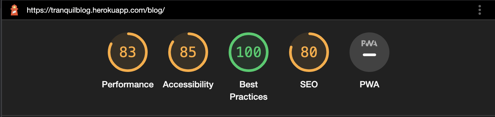

 

### **Code Validation**
The [W3C Markup Validator](https://validator.w3.org/ "Link to W3C Markup Validator Site") service was used to validate the `HTML` and `CSS` code used. The [PEP8 Python Validator](http://pep8online.com/ "Link to the PEP8 Python Validator Site") was used to validate the `Python` code used. The [JSHint JavaScript Validator](https://jshint.com/ "Link to the JSHint JavaScript Validator Site") was used to validate the `JavaScript` code used.

#### **Results:**

#### **HTML Pages**

HTML Validation Errors

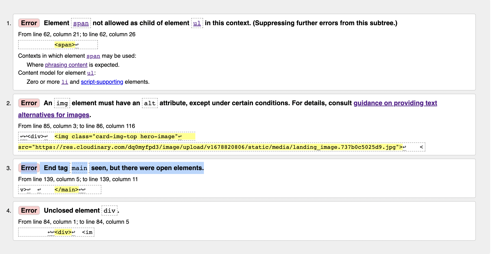

HTML Validation

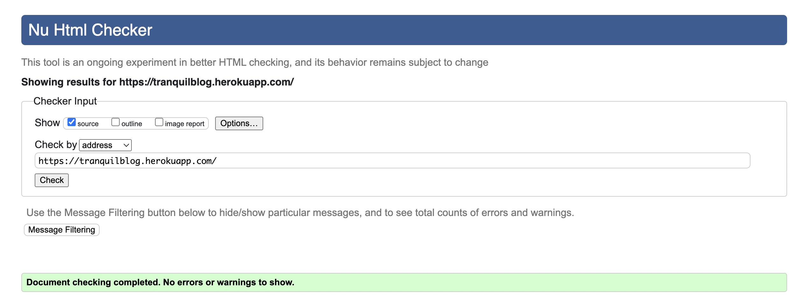

 

#### **CSS Stylesheets**

CSS Validation

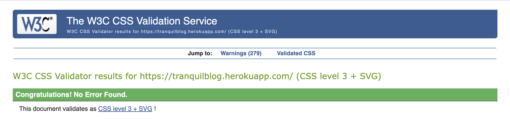

 

### **Python Files**

Blog

admin.py
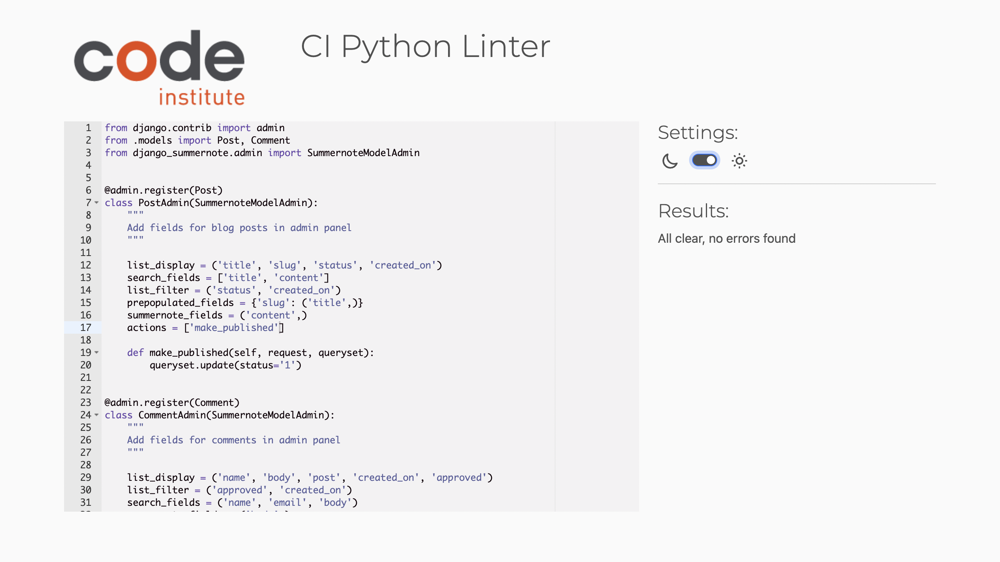

forms.py
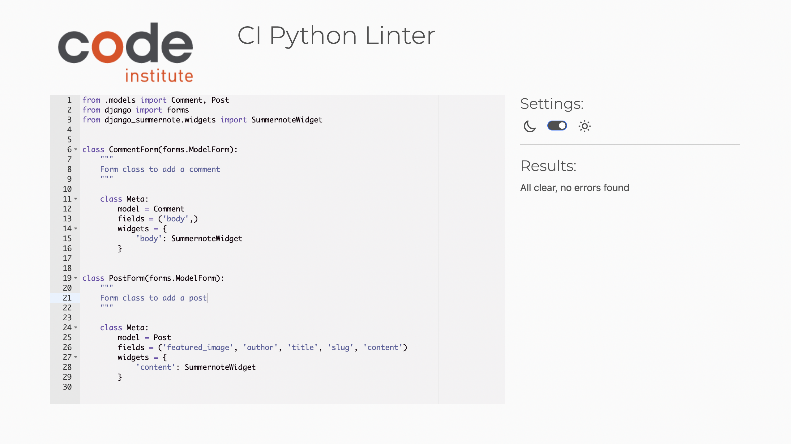

models.py
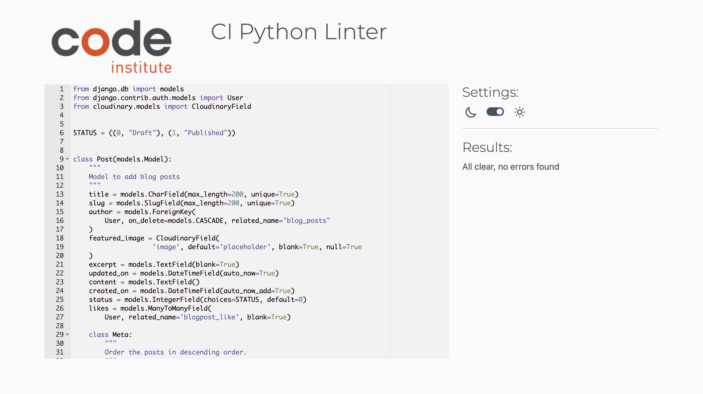

urls.py
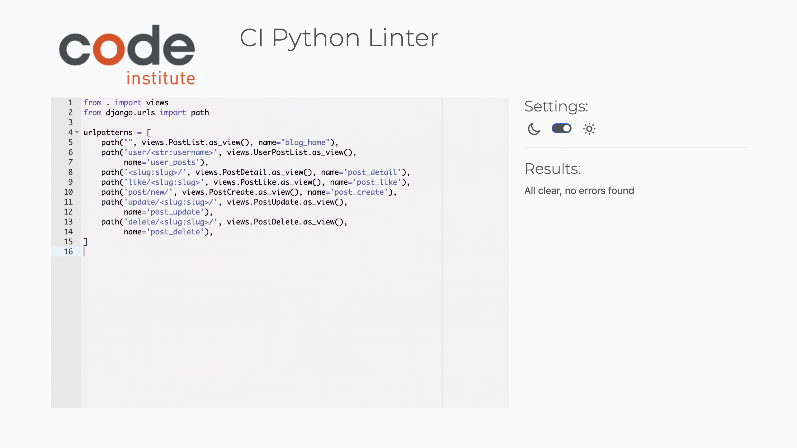

views.py
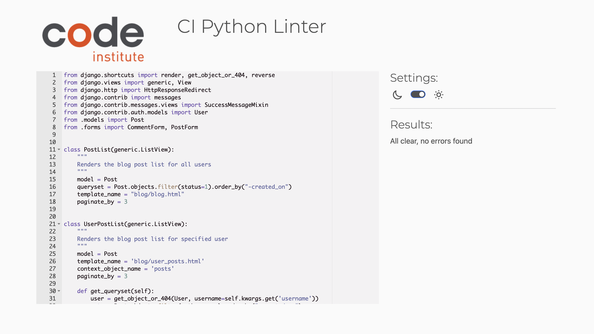

Home

forms.py
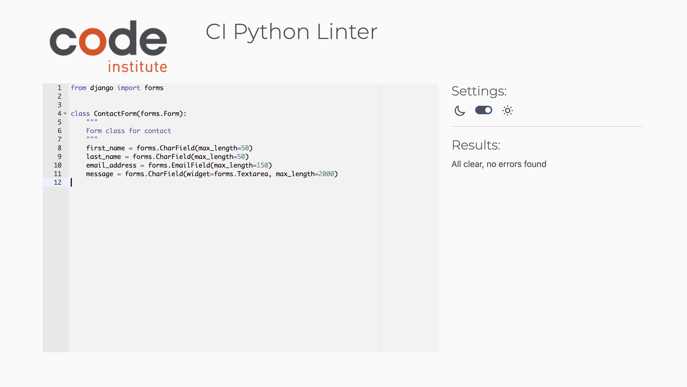

urls.py
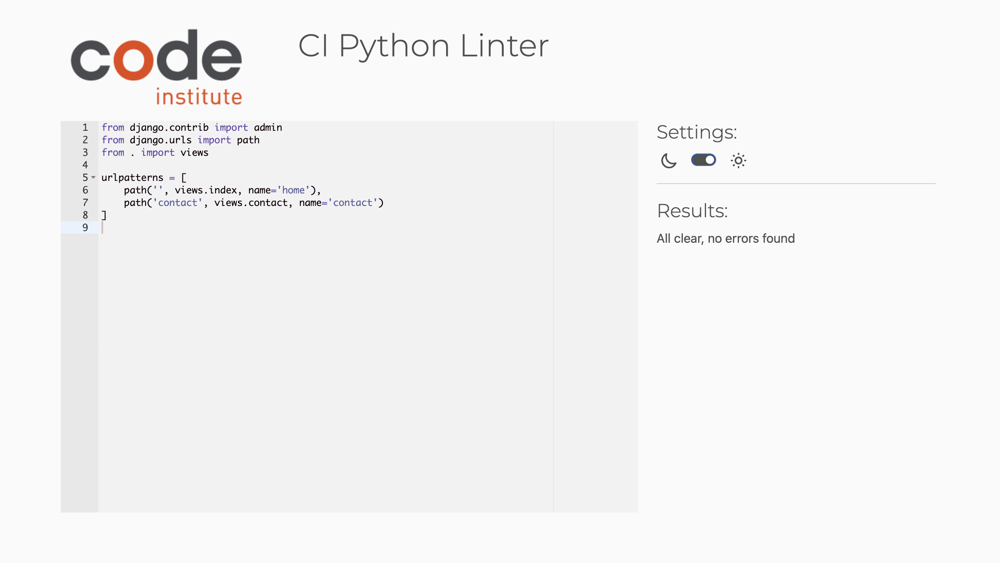

views.py
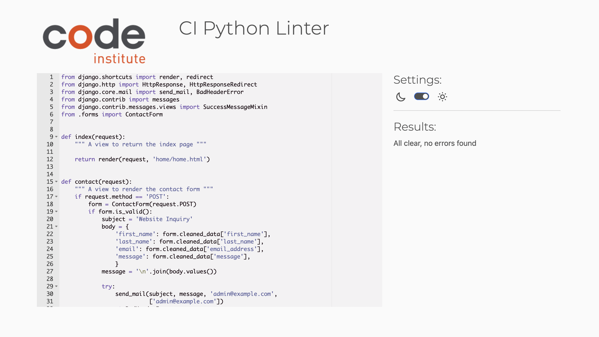

Tranquilblog

urls.py
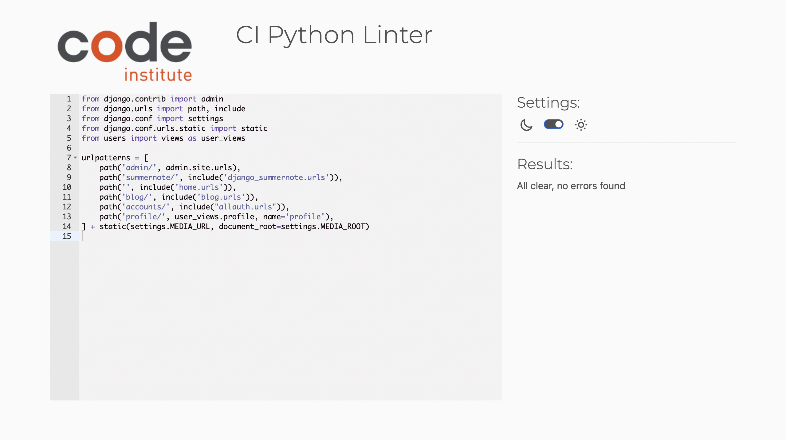

Users

forms.py
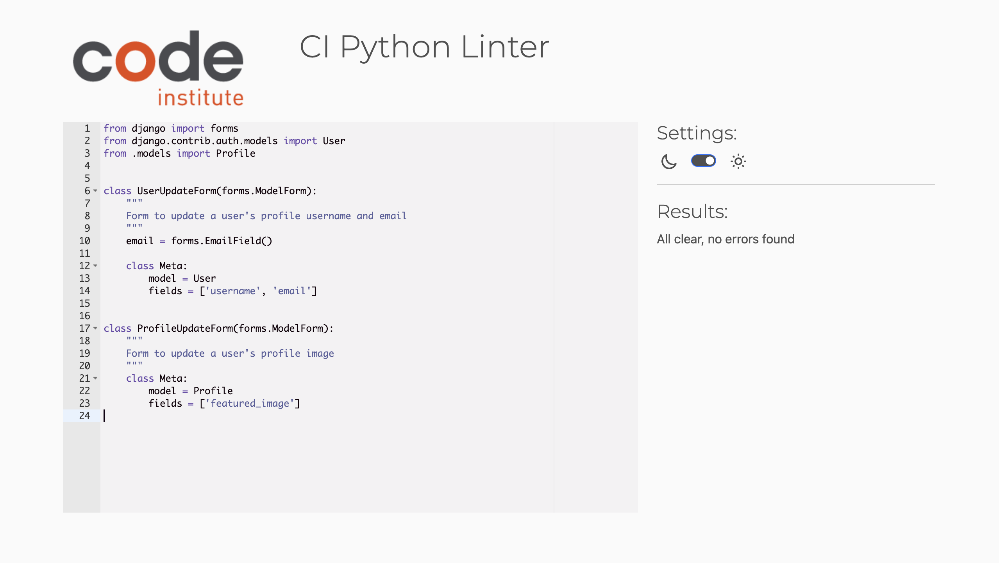

models.py
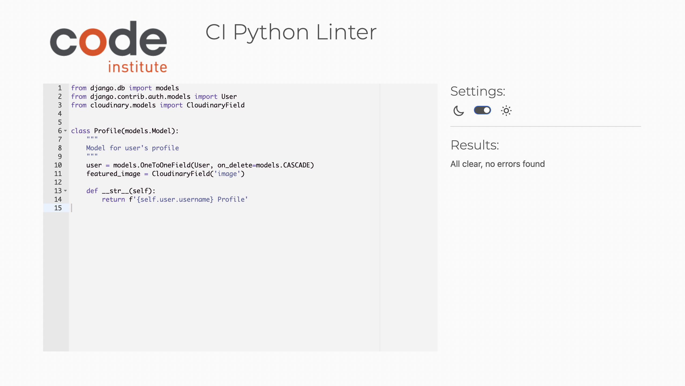

signals.py
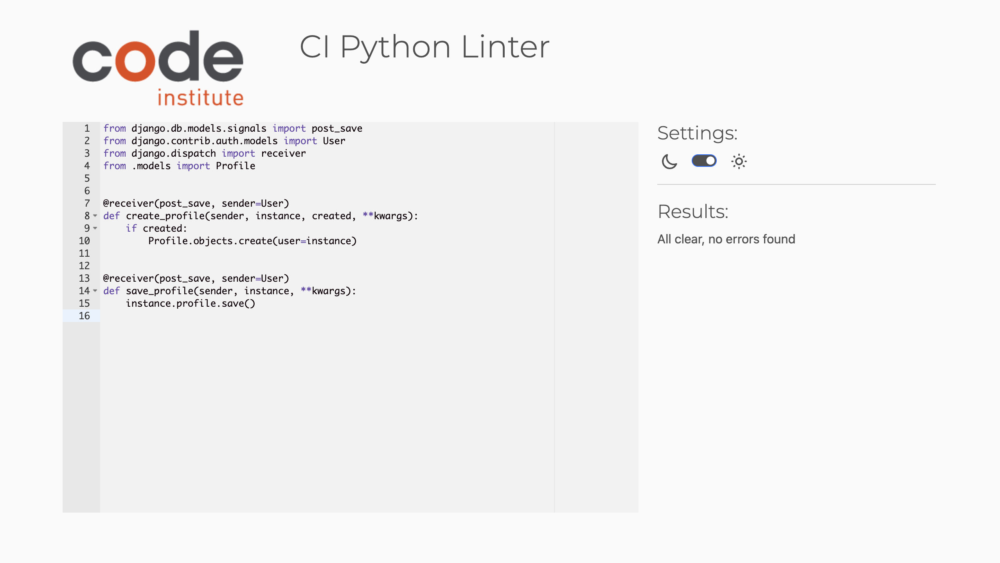

views.py
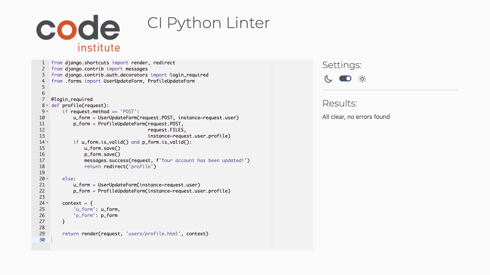

 

## **Bugs**
### **Solved Bugs**
* I had an issue using crispy forms for my blog posts, getting the “TemplateDoesNotExist” error when I clicked on a post. I found a solution in this [stack overflow link](https://stackoverflow.com/questions/24822509/success-message-in-deleteview-not-shown),  adding these lines to my settings file; 
    `CRISPY_ALLOWED_TEMPLATE_PACKS = "bootstrap5”` and
    `CRISPY_TEMPLATE_PACK = 'bootstrap5'`
* Unable to display success message after a post has been successfully deleted. I learnt that the SuccessMessageMixin hooks to form_valid which is not present on DeleteView to push its message to the user. [Link to solution here](https://stackoverflow.com/questions/24822509/success-message-in-deleteview-not-shown). 
* I had an issue with my images loading, using Cloudinary as my media and static files storage. It was being uploaded to Cloudinary, but the path of the image was not changing as it is a media file. I had to move the media folder within the static files, so it would be uploaded to Cloudinary . I also had to hard code the image and then change the file path to the image. This was solved with the help of a CI tutor. 

### **Unsolved Bugs**
I had limited time to fix the following. In the first submission, I did not implement these features, hence making it challenging to find a way around it promptly. 
* The image fields were not showing the current image for the blog and profile. 
* I was unable to resize the profile images, as adding images with high resolution fills and distorts the whole page. Resizing the image would also have saved space when uploaded on the web server.  

### **Note:**
The contact form was left in testing mode. The email is sent to the CLI and not to an email inbox, using the Django email backend in settings.py. 

### **Responsive Testing**
I have tested this project's responsiveness across multiple devices and screen sizes using Google developer tools. 

