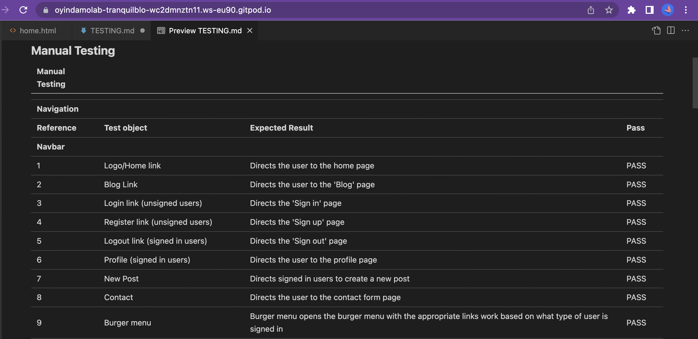
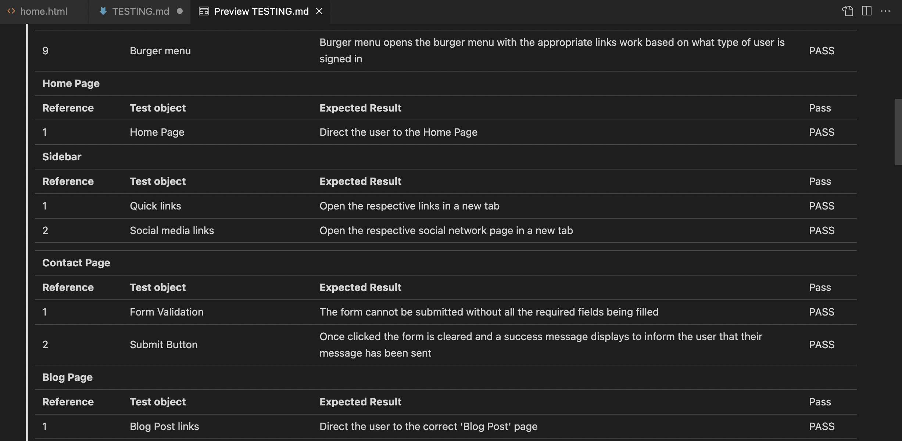
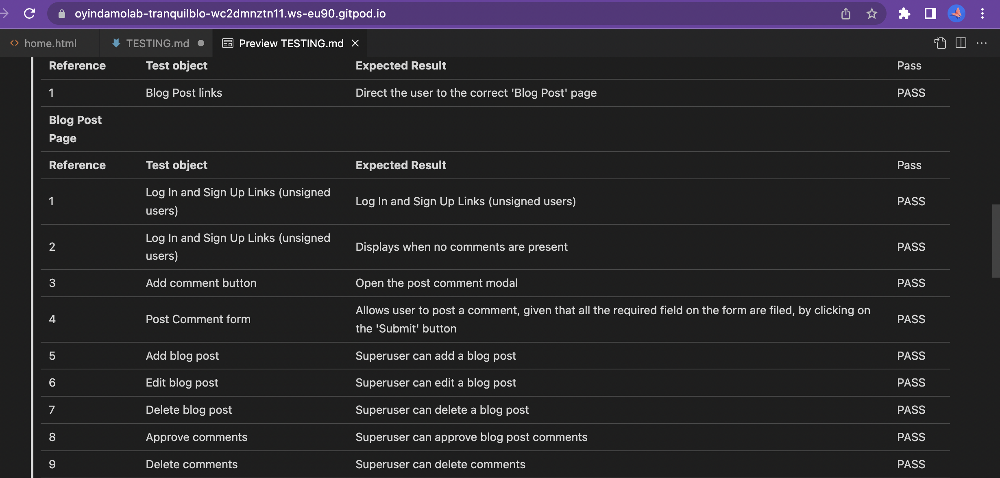
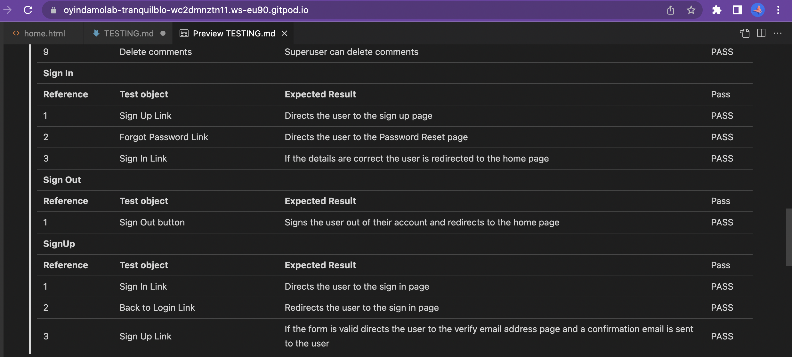

<h1 align="center">TRANQUILBLOG TESTING FILE</h1>

### **Live Site:**

[Click here to visit the live site.](https://tranquilblog.herokuapp.com/)

### **Readme File:**
[Click here to visit the Readme File.](README.md)

## **Manual Testing**

[Back to top](#)

## **Automated Testing**

### **Lighthouse**

Lighthouse

 

### **Code Validation**
The [W3C Markup Validator](https://validator.w3.org/ "Link to W3C Markup Validator Site") service was used to validate the `HTML` and `CSS` code used. The Code Institute Python Linter was used to validate the `Python` code used. 

#### **Results:**

#### **HTML Pages**

HTML Validation Errors

HTML Validation

 

#### **CSS Stylesheets**

CSS Validation

 

### **Python Files**

Blog

admin.py

forms.py

models.py

urls.py

views.py

Home

forms.py

urls.py

views.py

Tranquilblog

urls.py

Users

forms.py

models.py

signals.py

views.py

 

## **Bugs**
### **Solved Bugs**
* I had an issue using crispy forms for my blog posts, getting the “TemplateDoesNotExist” error when I clicked on a post. I found a solution in this [stack overflow link](https://stackoverflow.com/questions/24822509/success-message-in-deleteview-not-shown),  adding these lines to my settings file; 
    `CRISPY_ALLOWED_TEMPLATE_PACKS = "bootstrap5”` and
    `CRISPY_TEMPLATE_PACK = 'bootstrap5'`
* Unable to display success message after a post has been successfully deleted. I learnt that the SuccessMessageMixin hooks to form_valid which is not present on DeleteView to push its message to the user. [Link to solution here](https://stackoverflow.com/questions/24822509/success-message-in-deleteview-not-shown). 
* I had an issue with my images loading, using Cloudinary as my media and static files storage. It was being uploaded to Cloudinary, but the path of the image was not changing as it is a media file. I had to move the media folder within the static files, so it would be uploaded to Cloudinary . I also had to hard code the image and then change the file path to the image. This was solved with the help of a CI tutor. 

### **Unsolved Bugs**
I had limited time to fix the following. In the first submission, I did not implement these features, hence making it challenging to find a way around it promptly. 
* The image fields were not showing the current image for the blog and profile. 
* I was unable to resize the profile images, as adding images with high resolution fills and distorts the whole page. Resizing the image would also have saved space when uploaded on the web server. 
* Noticed very close to submission that the card text on the landing page was not very responsive on small screen sizes. 

### **Note:**
The contact form was left in testing mode. The email is sent to the CLI and not to an email inbox, using the Django email backend in settings.py. 

### **Responsive Testing**
I have tested this project's responsiveness across multiple devices and screen sizes using Google developer tools. 

